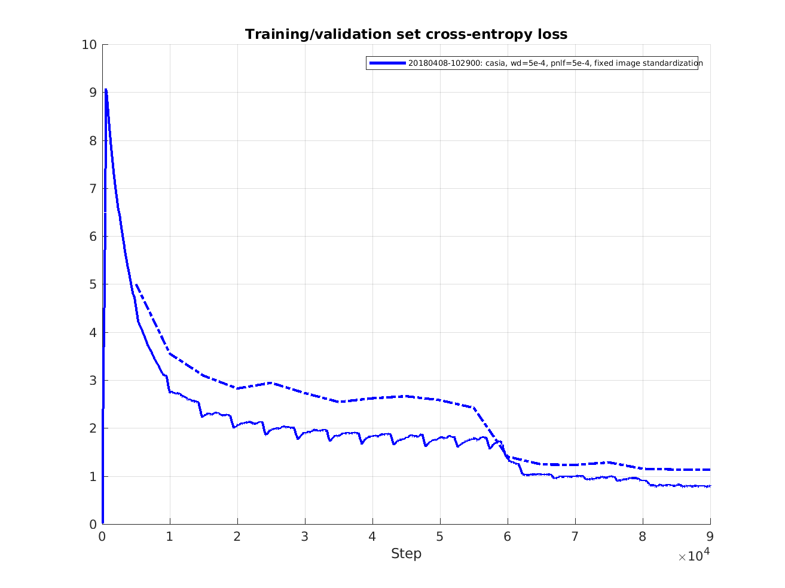

This page describes how to train the [Inception-Resnet-v1 model](https://arxiv.org/abs/1602.07261) as a classifier, i.e. not using Triplet Loss as was described in the [Facenet](http://arxiv.org/abs/1503.03832) paper. As noted [here](http://www.robots.ox.ac.uk/~vgg/publications/2015/Parkhi15/parkhi15.pdf), training as a classifier makes training significantly easier and faster.
The Facenet paper also used the non-ResNet version of the Inception architecture. These networks seems to be more difficult to train and does not converge very well when trained on the CASIA/Facescrub datasets. This can for example be seen as a relatively large loss on the training set also when no regularization is used, implying that the model is unable to overfit the data. Using e.g. the Inception-Resnet-v1 solves the convergence problem and results in significantly improved performance on LFW, both looking at the accuracy and the validation rate (VAL@FAR=10^-3).

## 1. Install Tensorflow
The current version of this implementation requires Tensorflow version r1.7. It can be installed using [pip](https://www.tensorflow.org/get_started/os_setup#pip_installation) or from [sources](https://www.tensorflow.org/get_started/os_setup#installing_from_sources).<br>
Since training of deep neural networks is extremely computationally intensive it is recommended to use a CUDA enabled GPU. The Tensorflow installation page has a detailed description of how to install CUDA as well.

## 2. Clone the FaceNet [repo](https://github.com/davidsandberg/facenet.git)
This is done using the command <br>
`git clone https://github.com/davidsandberg/facenet.git`

## 3. Set the python paths
Set the environment variable `PYTHONPATH` to point to the `src` directory of the cloned repo. This is typically done something like this<br>
`export PYTHONPATH=[...]/facenet/src`<br>
where `[...]` should be replaced with the directory where the cloned facenet repo resides.

## 4. Prepare training dataset(s)
### Dataset structure
It is assumed that the training dataset is arranged as below, i.e. where each class is a sub-directory containing the training examples belonging to that class.

    Aaron_Eckhart
        Aaron_Eckhart_0001.jpg

    Aaron_Guiel
        Aaron_Guiel_0001.jpg

    Aaron_Patterson
        Aaron_Patterson_0001.jpg

    Aaron_Peirsol
        Aaron_Peirsol_0001.jpg
        Aaron_Peirsol_0002.jpg
        Aaron_Peirsol_0003.jpg
        Aaron_Peirsol_0004.jpg
        ...

### Face alignment
For face alignment it is recommended to use [MTCNN](https://github.com/kpzhang93/MTCNN_face_detection_alignment) which has been proven to give very good performance for alignment of train/test sets. The authors have been kind enough to provide an implementation of MTCNN based on Matlab and Caffe. In addition, a matlab script to align a dataset using this implementation can be found [here](https://github.com/davidsandberg/facenet/blob/master/tmp/align_dataset.m).

To simplify the usage of this project a python/tensorflow implementation of MTCNN is [provided](https://github.com/davidsandberg/facenet/tree/master/src/align). This implementation does not have any other external dependencies than Tensorflow and the runtime on LFW is similar to the matlab implementation.

```
python src/align/align_dataset_mtcnn.py \
~/datasets/casia/CASIA-maxpy-clean/ \
~/datasets/casia/casia_maxpy_mtcnnpy_182 \
--image_size 182 \
--margin 44
```

The face thumbnails generated by the above command are 182x182 pixels. The input to the Inception-ResNet-v1 model is 160x160 pixels giving some margin to use a random crop.
For the experiments that has been performed with the Inception-ResNet-v1 model an margin additional margin of 32 pixels has been used. The reason for this additional widen the bounding box given by the face alignment and give the CNN some additional contextual information. However, the setting of this parameter has not yet been studied and it could very well be that other margins results in better performance.

To speed up the alignment process the above command can be run in multiple processes. Below, the same command is ran using 4 processes. To limit the memory usage of each Tensorflow  session the parameter `gpu_memory_fraction` is set to 0.25, meaning that each session is allowed to use maximum 25% of the total GPU memory. Try to decrease the number of parallel process and increase the fraction of GPU memory for each session if the below command causes the GPU memory to run out of memory.
```
for N in {1..4}; do \
python src/align/align_dataset_mtcnn.py \
~/datasets/casia/CASIA-maxpy-clean/ \
~/datasets/casia/casia_maxpy_mtcnnpy_182 \
--image_size 182 \
--margin 44 \
--random_order \
--gpu_memory_fraction 0.25 \
& done
```

## 5. Start classifier training
Training is started by running `train_softmax.py`. <br>
```
python src/train_softmax.py \
--logs_base_dir ~/logs/facenet/ \
--models_base_dir ~/models/facenet/ \
--data_dir ~/datasets/casia/casia_maxpy_mtcnnalign_182_160/ \
--image_size 160 \
--model_def models.inception_resnet_v1 \
--lfw_dir ~/datasets/lfw/lfw_mtcnnalign_160/ \
--optimizer ADAM \
--learning_rate -1 \
--max_nrof_epochs 150 \
--keep_probability 0.8 \
--random_crop \
--random_flip \
--use_fixed_image_standardization \
--learning_rate_schedule_file data/learning_rate_schedule_classifier_casia.txt \
--weight_decay 5e-4 \
--embedding_size 512 \
--lfw_distance_metric 1 \
--lfw_use_flipped_images \
--lfw_subtract_mean \
--validation_set_split_ratio 0.05 \
--validate_every_n_epochs 5 \
--prelogits_norm_loss_factor 5e-4
```

When training is started subdirectories for training session named after the data/time training was started on the format `yyyymmdd-hhmm` is created in the directories `log_base_dir` and `models_base_dir`. The parameter `data_dir` is used to point out the location of the training dataset. It should be noted that the union of several datasets can be used by separating the paths with a colon. Finally, the descriptor of the inference network is given by the `model_def` parameter. In the example above, `models.inception_resnet_v1` points to the `inception_resnet_v1` module in the package `models`. This module must define a function `inference(images, ...)`, where `images` is a placeholder for the input images (dimensions <?,160,160,3> in the case of Inception-ResNet-v1) and returns a reference to the `embeddings` variable.

If the parameter `lfw_dir` is set to point to a the base directory of the LFW dataset the model is evaluated on LFW once every 1000 batches. For information on how to evaluate an existing model on LFW, please refer to the [Validate-on-LFW](https://github.com/davidsandberg/facenet/wiki/Validate-on-LFW) page. If no evaluation on LFW is desired during training it is fine to leave the `lfw_dir` parameter empty. However, please note that the LFW dataset that is used here should have been aligned in the same way as the training dataset.  

The training will continue until the `max_nrof_epochs` is reached or training is terminated from the learning rate schedule file (see below). In this example training stops after 90 epochs. With a Nvidia Pascal Titan X GPU, Tensorflow r1.7, CUDA 8.0 and CuDNN 6.0 and the `inception-resnet-v1` model this takes roughly 10 hours.

To improve the performance of the final model the learning rate is decreased by a factor 10 when the training starts to converge. This is done through a learning rate schedule defined in a text file pointed to by the parameter `learning_rate_schedule_file` while also setting the parameter `learning_rate` to a negative value. For simplicity the learning rate schedule used in this example [data/learning_rate_schedule_classifier_casia.txt](https://github.com/davidsandberg/facenet/blob/master/data/learning_rate_schedule_classifier_casia.txt) is also included in the repo. The schedule looks like this:
```
# Learning rate schedule
# Maps an epoch number to a learning rate
0:  0.05
60: 0.005
80: 0.0005
91: -1
```
Here, the first column is the epoch number and the second column is the learning rate, meaning that when the epoch number is in the range 60...80 the learning rate is set to 0.005. For epoch 91 the learning rate is set to -1 and this will cause training to stop.

The L2 weight decay is set to 5e-4 and the dropout keep probability is set to 0.8. In addition to this regularization an L1 norm loss is applied to the prelogits activations (`--prelogits_norm_loss_factor 5e-4`). This will make the activations a bit more sparse and improve the models ability to generalize a little bit.

## 6. Running TensorBoard (optional)
While FaceNet training is running it can be interesting to monitor the learning process. This can be done using [TensorBoard](https://www.tensorflow.org/how_tos/summaries_and_tensorboard/#launching-tensorboard). To start TensorBoard, run the command <br>`tensorboard --logdir=~/logs/facenet --port 6006`<br> and then point your web browser to <br>http://localhost:6006/

## 7. Plotting learning curves
If evaluation on the LFW dataset is used the training will produce a text file containing the learning curve (accuracy and validation rate per epoch). This text file can be found in the log directory and can be used to easily plot the model performance vs. training step. The matlab script to plot the below learning curves can be found [here](https://github.com/davidsandberg/facenet/blob/master/util/plot_learning_curves.m).

### LFW accuracy
<br>
Here it can be seen that even if the accuracy in the last evaluation is 0.9965 the average
accuracy for the last 10 evaluations is a bit lower (0.9950) which is probably closer
to what one could expect when reproducing the results. The average is probably a better metric to use when
for example comparing different hyper parameter settings.

### Training/validation cross entropy loss
<br>
This figure shows the cross entropy loss during training (solid line) and validation (dashed line).
The validation set consist of around 20000 images and evaluation is performed every 5 epochs.
The cross entropy during training is logged at every training step but has been filtered with a sliding average filter over 500 steps.
From this it's obvious that the model overfits a bit so it could be good to experiment a bit more with the L2 weight decay and dropout keep probability.

### Training/validation accuracy
<br>
This figure shows the accuracy during training (solid line) and validation (dashed line).
The validation set consist of around 20000 images and evaluation is performed every 5 epochs.
The accuracy during training is logged at every training step but has been filtered with a sliding average filter over 500 steps.
