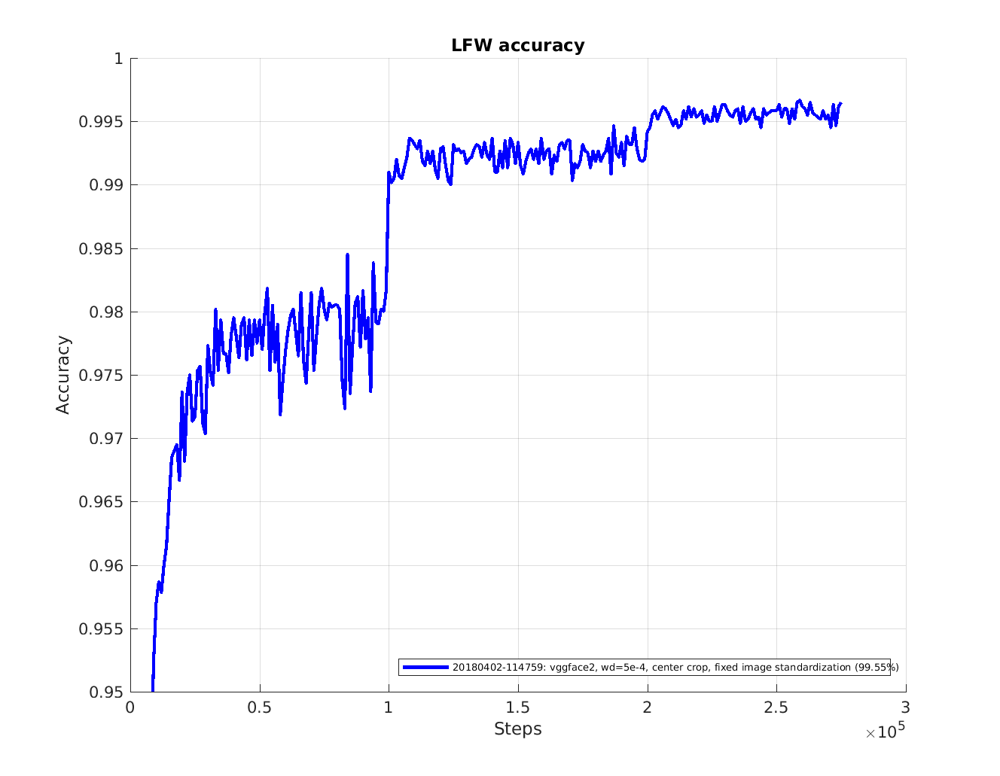
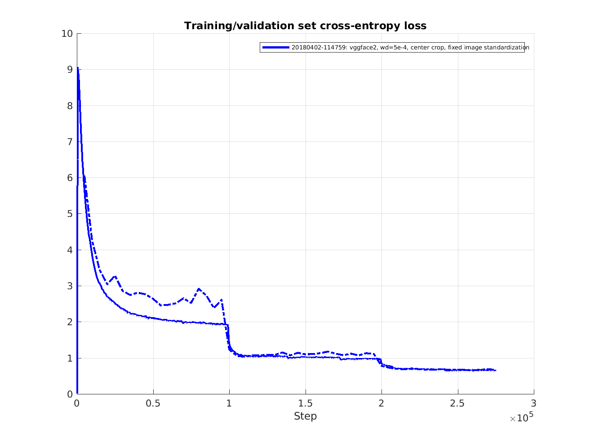
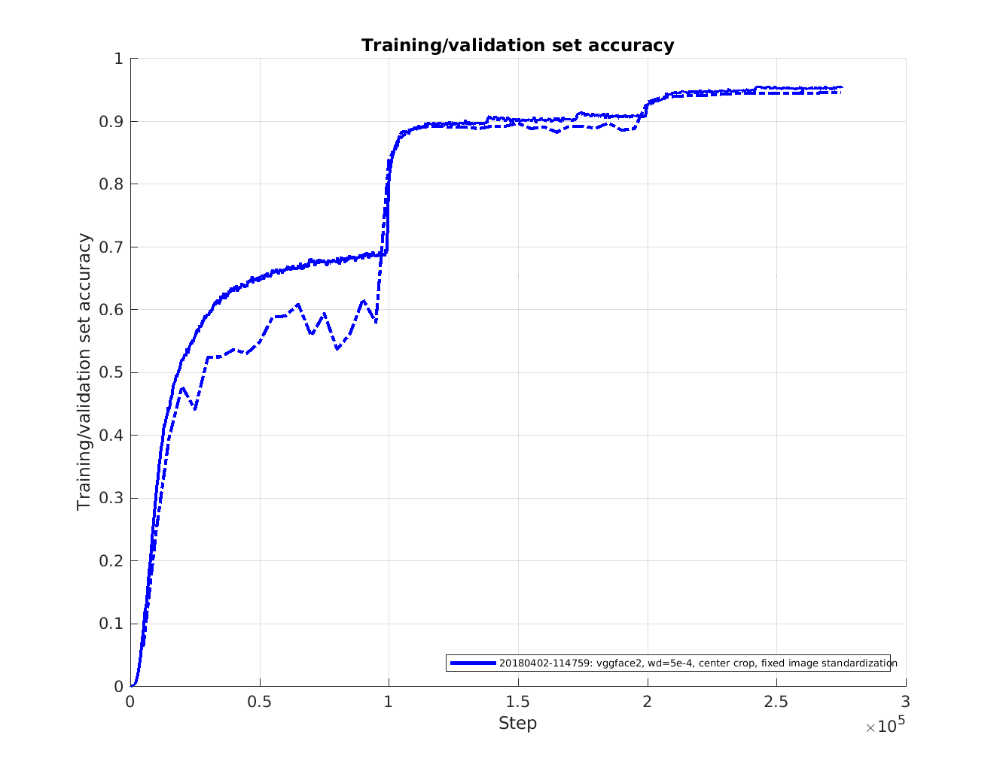

## The VGGFace2 dataset

This page describes the training of a model using the [VGGFace2 dataset](https://www.robots.ox.ac.uk/~vgg/data/vgg_face2/) and softmax loss.
The dataset contains 3.31 million images of 9131 subjects (identities), with an average of 362.6 images for each subject. Images are downloaded from Google Image Search and have large variations in pose, age, illumination, ethnicity and profession (e.g. actors, athletes, politicians).
The VGGFace2 consist of a training set and a validation set. Here only the training part of the datatset is used. Identities overlap with LFW has not been removed.

## Training
It is assumed that steps 1 to 4 from the page [Classifier training of Inception Resnet v1](Classifier-training-of-inception-resnet-v1) has been completed.

### Difference to previous models
This model uses fixed image standardization which gives slightly improved performance and is also simpler.
However, to get good performance the model has to be evaluated using the same type of image standardization. Hence, the flag `--use_fixed_image_standardization` should be used also for evaluation.
1% of the training images are used for validation. Since the amount of label noise in the VGGFace2 dataset is low no dataset filtering has been applied.

The table below summarizes the main differences compared to prevous released models like for example the model [20170512-110547](https://drive.google.com/file/d/0B5MzpY9kBtDVZ2RpVDYwWmxoSUk).

|Parameter|Previous|Current|
|----------|--------|--------|
|Embedding size | 128D | 512D|
|Image standardization | Per image | Fixed |
|Base learning rate | 0.1 | 0.05 |
|Optimizer | RMSProp | Adam |
|Dropout keep prob | 0.8 | 0.4 |
|Data augmentation| Random crop/flip| Random flip|
|Center loss | 1e-2 | Not used |

Also, when evaluating on LFW during training, the evaluation parameters are as follows:

|Evaluation parameter|Old|New|
|----------|--------|--------|
|Embeddings | Non-flipped | Flipped and non-flipped|
|Distance metric | Euclidian | Cosine |
|Subtract feature mean | No | Yes |
|Image standardization | Per image | Fixed |


The following command is used to start the training.

```
python src/train_softmax.py \
--logs_base_dir ~/logs/facenet/ \
--models_base_dir ~/models/facenet/ \
--data_dir ~/datasets/vggface2/vggface2_train_182/ \
--image_size 160 \
--model_def models.inception_resnet_v1 \
--lfw_dir ~/datasets/lfw/lfw_mtcnnalign_160/ \
--optimizer ADAM \
--learning_rate -1 \
--max_nrof_epochs 500 \
--batch_size 90 \
--keep_probability 0.4 \
--random_flip \
--use_fixed_image_standardization \
--learning_rate_schedule_file data/learning_rate_schedule_classifier_vggface2.txt \
--weight_decay 5e-4 \
--embedding_size 512 \
--lfw_distance_metric 1 \
--lfw_use_flipped_images \
--lfw_subtract_mean \
--validation_set_split_ratio 0.01 \
--validate_every_n_epochs 5
```
Training runs for 275000 steps and is terminated using the learning rate schedule
and takes around 30 hours on a Nvidia Pascal Titan X GPU, Tensorflow r1.7, CUDA 8.0 and CuDNN 6.0.

Below a few figures that summarizes the training progress can be found.

### LFW accuracy

<br>
Here it can be seen that even if the accuracy in the last evaluation is 0.9965 the average
accuracy for the last 10 evaluations is a bit lower (0.9950) which is probably closer
to what one could expect when reproducing the results. The average is probably a better metric to use when
for example comparing different hyper parameter settings.

### Training/validation cross entropy loss
<br>
This figure shows the cross entropy loss during training (solid line) and validation (dashed line).
The validation set consist of around 30000 images and evaluation is performed every 5 epochs.
The cross entropy during training is logged at every training step but has been filtered with a sliding average filter over 500 steps.

### Training/validation accuracy
<br>
This figure shows the accuracy during training (solid line) and validation (dashed line).
The validation set consist of around 30000 images and evaluation is performed every 5 epochs.
The accuracy during training is logged at every training step but has been filtered with a sliding average filter over 500 steps.

## Evaluation on LFW
Assuming that the trained model resides in the directory `~/models/facenet/20180402-114759/` it can be evaluated on LFW using the following command:
```
python src/validate_on_lfw.py  \
~/datasets/lfw/lfw_mtcnnalign_160/ \
~/models/facenet/20180402-114759/ \
--distance_metric 1 \
--use_flipped_images \
--subtract_mean \
--use_fixed_image_standardization
```
A pretrained model that has been trained using this procedure can be downloaded from [20180402-114759](https://drive.google.com/open?id=1EXPBSXwTaqrSC0OhUdXNmKSh9qJUQ55-). With this model the LFW evaluation script will produce an output like this:
```
Model directory: /home/david/models/facenet/20180402-114759/
Metagraph file: model-20180402-114759.meta
Checkpoint file: model-20180402-114759.ckpt-275
Runnning forward pass on LFW images
........................
Accuracy: 0.99650+-0.00252
Validation rate: 0.98367+-0.00948 @ FAR=0.00100
Area Under Curve (AUC): 1.000
Equal Error Rate (EER): 0.004
```
The below table summarizes the performance impact from some of the settings during evaluation.
It can be seen that using fixed image standardization is extremely important, manly because the model was trained with this setting.
Also, it can be seen that concatenating the embeddings for the normal and the horizontally flipped version of the image improves the performance quite a bit.

|use_flipped_images|distance_metric|subtract_mean|use_fixed_image_standardization|Accuracy|VAL@FAR=0.001|
|----------|----------|----------|----------|--------|--------|
|True | Cosine    | True | True | 0.99650+-0.00252 | 0.98367+-0.00948|
|False  | Cosine    | True | True | 0.99500+-0.00333 | 0.98200+-0.00933|
|True | Euclidian | True | True | 0.99600+-0.00281 | 0.97800+-0.01301|
|True | Cosine | False | True | 0.99600+-0.00281 | 0.97967+-0.01149|
|True | Cosine | True | False | 0.98867+-0.00323 | 0.92433+-0.02305|
