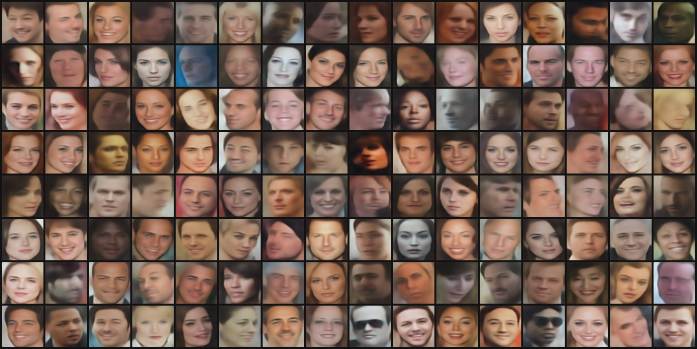
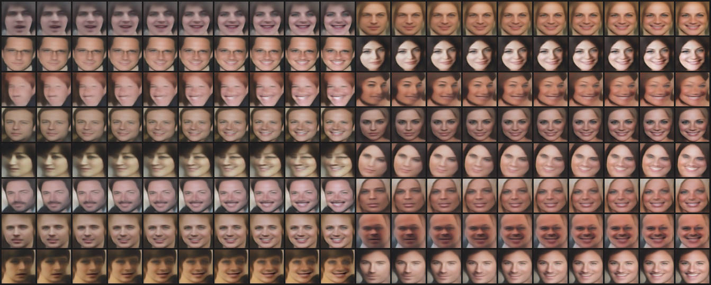

### Variational Autoencoder
This page described how to
1. Train a Variational Auto-encoder using facenet-based perceptual loss similar to the paper ["Deep Feature Consistent Variational Autoencoder"](https://arxiv.org/abs/1610.00291).
2. Calculate attribute vectors based on the attributes in the CelebA dataset.
3. Add smile to a face by adding the attribute vector to the latent variable of an image. Here the latent variables from the CelebA dataset are used to generate the unmodified face images.

If you want to you can just skip ahead to step 3 and use the VAE to modify facial features of an image.

Before starting it is assumed that you have
* Cloned the repo
* Set the python path
* Aligned the dataset(s)
* Downloaded and unpack a perceptual model. Here the [20170512-110547](https://drive.google.com/file/d/0B5MzpY9kBtDVZ2RpVDYwWmxoSUk) model is used.

### 1. Train a Variational Autoencoder
This section describes how to train a Variational Autoencoder (VAE) using perceptual loss, i.e. instead of a loss that depends on the pixel-wise difference between the training image and the reconstructed image the perceptual loss tries to generate an image that has similar spatial characteristics as the source image.

To achieve this the L2 difference between the some intermediate layer activations pre-trained in a pre-trained face recognition model. Exactly which layers to use for this has not been heavily investigated so there is probably room for improvement in this aspect. But there is no easy way to compare the performance of two models trained using different layers in perceptual model, so the results has to be inspected manually. It could be that some of the error cases where weird looking faces are generated could be avoid by using higher layers in the perceptual model.

Additionally, the factors for the reconstruction loss and the Kullback-Leibler divergence loss could probably also benefit from some more investigation/optimization.

The below command will train a VAE that generates 64x64 pixel images. The size of the generated images is decided by the VAE implementation.
The VAE implementations reside in the generative.models package. Implementations implement an encoder and a decoder as well as a method to get the image size for the VAE.

Currently the available models are:

| Model           | Generated image size |
|-----------------|----------------------|
| dfc_vae         | 64x64 pixels         |
| dfc_vae_resnet  | 64x64 pixels         |
| dfc_vae_large   | 128x128 pixels       |

This command trains the VAE for 50000 steps using perceptual loss and the [20170512-110547](https://drive.google.com/file/d/0B5MzpY9kBtDVZ2RpVDYwWmxoSUk) model. The model is trained on the CASIA-WebFace dataset, but it would be interesting to see if it would work better with a larger dataset (e.g. MS-Celeb-1M).
```
python src/generative/train_vae.py \
src.generative.models.dfc_vae \
~/datasets/casia/casia_maxpy_mtcnnpy_182 \
src.models.inception_resnet_v1 \
~/models/export/20170512-110547/model-20170512-110547.ckpt-250000 \
--models_base_dir ~/vae/ \
--reconstruction_loss_type PERCEPTUAL \
--loss_features 'Conv2d_1a_3x3,Conv2d_2a_3x3,Conv2d_2b_3x3' \
--max_nrof_steps 50000 \
--batch_size 128 \
--latent_var_size 100 \
--initial_learning_rate 0.0002 \
--alfa 1.0 \
--beta 0.5
```
Training for 50000 steps with these parameters takes around 4 hours on a Pascal Titan X. Every 500 steps the training script will store a batch of reconstructed faces to a .png file. The last batch for the above training looked like this:


The trained model can be downloaded from [here](https://drive.google.com/open?id=0B5MzpY9kBtDVS2R5Wm5IRFpST2M) together with the attribute vectors calculated in step 2.

### 2. Calculate attribute vectors

In this step the [CelebA dataset](http://mmlab.ie.cuhk.edu.hk/projects/CelebA.html) is used to calculate vectors in latent variable space for a number of attributes. The CelebA dataset contains ~200k images annotated with 40 different attributes, like `Blond Hair` and `Mustache` (see below for a complete list of attributes). However, in this example only the 'Smiling' attribute is used though.
The script works by calculate latent variables for all images in the CelebA dataset. The average latent variable when each attribute is present/non-present is then calculated. This is done by, for example, finding all images where the attribute 'Smiling' is not present and where the same attribute is present. The attribute vector is then calculated as the different between the two average latent variables.


The VAE model checkpoint should point to the checkpoint trained in step 1. Before running this the CelebA dataset should be aligned as well. The `list_attr_celeba.txt` file contains the 40 attributes for each image and is available for download together with the dataset itself.

```
python src/generative/calculate_attribute_vectors.py \
src.generative.models.dfc_vae \
~/vae/20170708-150701/model.ckpt-50000 \
~/datasets/celeba/img_celeba \
~/datasets/celeba/list_attr_celeba.txt \
~/vae/20170708-150701/attribute_vectors.h5 \
--batch_size 128 \
--image_size 160 \
--latent_var_size 100
```

In the last iteration a warning will show up:<br>
```Out of range: FIFOQueue '_0_input_producer/input_producer/fraction_of_32_full/fraction_of_32_full' is closed and has insufficient elements (requested 1, current size 0)```
<br>This is due to that the the last batch contains fewer examples than the batch size and the input producer cannot fill up the batch completely.

### 3. Add smile to a face
If you skip step 1 and 2 you can download a pretrained VAE and the attribute vectors calculated from the CelebA dataset from [here](https://drive.google.com/open?id=0B5MzpY9kBtDVS2R5Wm5IRFpST2M).

To demonstrate to usage of the VAE we can then modify attributes of an image. To make it simple for ourselves we use images that we have already calculated the latent variables for (in step 2). We select a number of faces where the 'Smiling' attribute is not present. We then add different amounts of the 'Smiling' attribute vector (also calculated in step 2) and write the result to a file.

```
python src/generative/modify_attribute.py \
src.generative.models.dfc_vae \
~/vae/20170708-150701/model.ckpt-50000 \
~/vae/20170708-150701/attribute_vectors.h5 \
~/vae/20170708-150701/add_smile.png
```

The above script creates an image with a number of different faces, each face modified by adding different amount of the smile vector to the latent variable. The result looks like this:



It should be noted that the parameters has not been optimized a lot and there is probably room for improvement by tuning parameters like which features to use for perceptual loss (i.e. `loss_features`).

In this example we used an image from the CelebA dataset that we already had calculated the latent variable for. But it is straight forward to modify the script to take an input image, calculate the latent variable for it (by running the encoder), modify the latent variable by adding/subtracting an attribute vector, and then generate a new image by running the decoder.

### CelebA attributes

Here is a complete list of the attributes the CelebA dataset is annotated with:

`5_o_Clock_Shadow, Arched_Eyebrows, Attractive, Bags_Under_Eyes, Bald, Bangs, Big_Lips, Big_Nose, Black_Hair, Blond_Hair, Blurry, Brown_Hair, Bushy_Eyebrows, Chubby, Double_Chin, Eyeglasses, Goatee, Gray_Hair, Heavy_Makeup, High_Cheekbones, Male, Mouth_Slightly_Open, Mustache, Narrow_Eyes, No_Beard, Oval_Face, Pale_Skin, Pointy_Nose, Receding_Hairline, Rosy_Cheeks, Sideburns, Smiling, Straight_Hair, Wavy_Hair, Wearing_Earrings, Wearing_Hat, Wearing_Lipstick, Wearing_Necklace, Wearing_Necktie, Young`
